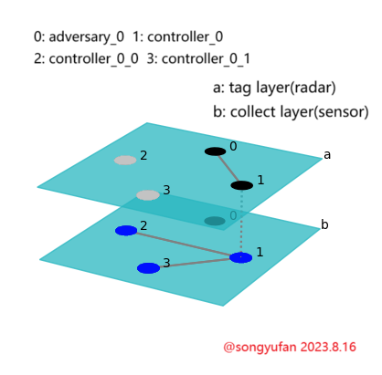

# Tag while collecting v1

```
Multilayer Multiagent Reinforcement Learning:
TAG while COLLECTING
proposed and implemented by Songyufan
author: [@github](https://github.com/Super3001)
```
### 一、Pettingzoo依赖库搭载

Pettingzoo是一个用于研究多智能体博弈和强化学习环境的Python库。它提供了一系列不同类型的多智能体环境，可以用于开展各种实验和研究。Pettingzoo是OpenAI公司开发的开源多智能体强化学习库，目前在持续维护中。Pettingzoo是在OpenAI的旧强化学习库multiagent基础上开发的，而multiagent库本身已经不再维护，注意本项目不能直接移植到multiagent库上。

本项目基于Pettingzoo中的simple_tag_v3（最新版）环境。

以下是安装和使用PettingZoo的一般步骤：
安装：
1. 打开终端或命令提示符。
2. 使用以下命令安装PettingZoo：

```bash
pip install pettingzoo
```

使用：
1. 导入所需的环境：
```python
import pettingzoo
print(pettingzoo.__version__) # 打印pettingzoo的版本
```

2. 创建一个PettingZoo环境实例，例如：
```python
from pettingzoo.mpe import simple_tag_v3
env = simple_tag_v3.parallel_env() # 实验中要用到parallel的environment
```
这将创建一个名为"simple_tag_v3"的PettingZoo环境实例。
<br>
3. 初始化环境并进行交互：

```python
EPISODE_LENGTH = 25
observation, info = env.reset()
count = 0 # 记录步数
cumulated_reward = np.zeros(env.n) # 记录累计奖励
while count < EPISODE_LENGTH:
    for agent in env.agent_iter():
        action = env.action_space(agent).sample()
        # this is where you would insert your policy

        observations, rewards, termination, truncation, info = env.step(action)
        if termination or truncation:
           	break
        print(count, agent, action, reward)
        cumulated_reward += reward
    # end for
    count += 1
# end while
env.close()
print("cumulated_reward: ", cumulated_reward) # 打印回报
```
在这个示例中，`action_space(agent).sample()` 用于产生一个随机的动作，实际应该由你的智能体策略来生成动作。

4. 在循环中反复调用 `env.step(action)` 以与环境交互。当 `termination`或者`truncation` 变量为 `True` 时，表示环境达到了终止状态，循环可以结束。

### 二、MPE环境搭载

1. 导入模块和创建环境：
```python
import pettingzoo
env = pettingzoo.mpe.simple_tag_v3.env()
```
2. **初始化环境并与之交互**：
初始化环境并开始与环境交互。你可以使用`reset()`方法初始化环境，然后使用`step(action)`方法与环境进行交互，传递智能体的动作，获得观测、奖励、终止信号等返回值。
```python
observation = env.reset()
done = False
while not done:
    action = env.action_space.sample()  # 在示例中使用随机动作，实际应该由智能体的策略生成
    observation, reward, done, info = env.step(action)
```
3. **编写智能体策略**：
在交互过程中，可以通过训练深度学习模型，训练出好的智能体策略来生成动作。根据MPE环境的不同，你可能需要设计不同的策略来实现协作、对抗或合作等目标。

4. **终止和结果分析**：
当`termination`或者`truncation`变量为True时，表示一个回合结束。你可以在每个回合结束后分析奖励、观测和其他信息，以及在多智能体环境中的智能体之间的互动情况。
需要注意的是，不同的MPE环境可能有不同的动作空间、观测空间和规则。因此，需要采取不同的策略模型来进行训练。

### 三、Simple Tag
Simple Tag属于MPE（Multi-Agent Particle Environments），用于研究多智能体对抗性博弈问题。在这个环境中，存在一组“追逐者”（Predator）和一个“逃避者”（Prey），追逐者的目标是捕捉逃避者，而逃避者的目标是尽可能避免被追逐者捕捉。
以下是Simple Tag环境的主要特点和操作方法：

官方文档：
| Import | from pettingzoo.mpe import simple_tag_v3 |
| --- | --- |
| Actions | Discrete/Continuous |
| Parallel API | Yes |
| Agents | ``agents= [adversary_0, adversary_1, adversary_2, agent_0]`` |
| Agents_num | 4 |
| Action Shape | (5) |
| Action Values | Discrete(5)/Box(0.0, 1.0, (50)) |
| Observation Shape | (14),(16) |
| Observation Values | (-inf,inf) |
| State Shape | (62,) |
| State Values | (-inf,inf) |

### multilayer structure



1. **智能体**：
- 追逐者（Predator）：多个追逐者智能体，他们的目标是合作追捕逃避者。每个追逐者都可以移动并尝试捕捉逃避者。
- 逃避者（Prey）：一个逃避者智能体，他的目标是躲避追逐者的追捕。逃避者可以移动以尽可能避免被捕捉。
2. **观测空间**：
- 对于每个智能体，观测空间会包含有关周围环境：障碍物的位置，其他智能体位置和速度。
- Simple Tag中每个智能体的动作空间与智能体的角色有关。
**追逐者观测空间**：
大小:``(16,)``, 包含自身的位置、速度，障碍物的位置，good agent的位置和速度，bad agent的位置。
**逃避者观测空间**：
大小:``(14,)``, 包含自身的位置、速度，障碍物的位置，good agent的位置和速度，bad agent的位置。

注意，追逐者和逃避着都看不到其他追逐者的速度，只能看到位置。

3. **动作空间**：
    Simple Tag中每个智能体的动作空间与智能体的角色无关。它们的动作空间都分别有两种：连续的动作空间和离散的动作空间。

**连续的动作空间**：
- 每个追逐者的动作取值是连续的。动作的取值范围为``[0.0, 1.0]``，形状为``(50,)``。
- 通常情况下，追逐者的动作空间表示为一个二维的连续动作空间（x, y坐标）。每个追逐者可以在二维平面上选择一个位置来移动。(具体含义待考证)

**离散的动作空间**：
离散的动作空间相对来说容易理解。离散的动作空间中只有五个动作，分别是``[no_action, move_left, move_right, move_down, move_up]``。动作为一个整数，取值为``[0, 1, 2, 3, 4]``。

在项目中使用的是离散的动作空间

在对抗性博弈中，追逐者的目标是捕捉逃避者，而逃避者的目标是尽可能避免被捕捉。因此，每个智能体的动作选择会受到对方智能体位置的影响。逃避者的策略可能会使其尽量远离追逐者，而追逐者的策略可能会使其尽可能靠近逃避者。
要编写智能体的动作策略，可以使用各种强化学习算法或启发式方法，来决定每个智能体在每个时刻的移动位置。通常，会根据环境中的信息（如观测）以及与其他智能体的相互作用来制定动作策略，以实现特定的目标，如追捕或逃避。
4. **奖励**：
- 追逐者的目标是捕捉逃避者，因此他们的奖励在成功捕捉逃避者时会增加。
- 逃避者的目标是躲避追逐者，因此他的奖励在成功逃避时会增加。
- 为了不让逃避者跑到无限远，它们也会因为离开这个固定区域而受到惩罚
1. **终止条件**：
- 游戏会在逃避者被追捕或达到一定步数后终止。
Simple Tag环境提供了一个典型的多智能体对抗性博弈场景，其中追逐者和逃避者之间的策略和博弈决定了最终的结果。这个环境可以用来研究对抗性智能体的策略、协作、对抗以及动态的决策问题。
要使用Simple Tag环境，可以按照前面提到的步骤导入PettingZoo并创建环境实例。然后，编写智能体策略来探索追逐者和逃避者之间的对抗性博弈。这样就可以进行多智能体对抗性博弈问题的研究和实验。

### 四、Tag while Collecting
Tag while Collecting是基于Simple Tag环境建立的一个双层多智能体交互环境。其目的是模拟这样一个场景：智能体在收集资源的过程中，还要躲避追逐者的情况。在这个环境中，存在一个或多个“追逐者”（adversary），一个或多个“躲避者”（agent）和一组或多组“收集者”（collector），追逐者的目标与Simple Tag之中追逐者的目标相同，而躲避者会作为中继控制器，与收集者互传信号，在躲避追逐者的同时，使收集者收集到更多资源点。收集者的目标是在距离自己的中继控制器（躲避者）在一定范围之内，收集尽可能多的资源。收集者的移动是由躲避者控制的，躲避者的移动是由追逐者控制的，追逐者的移动是由追逐者自己控制的。在这个环境中，躲避者的策略会影响收集者的移动，而收集者的移动反过来会影响躲避者的移动，追逐者的移动也会影响躲避者的移动。这样就形成了一个双层的多智能体交互环境。

资源点的生成的位置是随机的。资源点采取不更新和更新两种模式形成两种不同的环境(R_update or NoR_update).

环境中没有障碍物(obstacle/landscape)

这个环境对应的实际物理场景是：一个可移动的通信中继器（或者机器人）与多个较小的带有小传感器的感知机器人通信相连。...

交互过程中的通信就在中继控制器(controller)与收集者(collector)之间。中继控制器与收集者之间通信信息的多少与环境的质量有关。按照通信优先级顺序，优先报送中继控制器的位置，其次报送收集者的位置，再次报送中继控制器的速度，最后报送收集者的速度。

[!img]____________________

自己编写的文档：
| Import | from my_envs.mpe import tag_while_collecting # twc_simple, twc_biobj |
| --- | --- |
| Actions | Discrete |
| Parallel API | Yes |
| Agents | ``agents= [adversary_0, controller_0, collector_00, collector_01]`` |
| Agents_num | 4 |
| State Shape | (62,) |
| State Values | (-inf,inf) |

| | adversary | controller | collector |
| --- | --- | --- | --- |
| Action Shape | (5,) | (5,) | (5,) |
| Action Values | Discrete(5) | Discrete(5) | Discrete(5) |
| Observation Shape | (8,) | (10,) or (14,) | (12,) or (14,) |
| Observation Values | (-inf,inf) | (-inf,inf) and (-1,1) | (-inf,inf) and (-1,1) |

1. **智能体**：在这个环境中有三种智能体。分别为追逐者、控制器、收集器。

   - 追逐者（adversary）：位于第一层结构中，追逐控制器

   - 控制器（controller）：位于第一层网络结构中，躲避追逐者，并与收集器通信

   - 收集器（collector）：位于第二层网络结构中，收集资源，并保证与自身对应的控制器的距离在一定范围之内

2. **观测空间**：
   - 追逐者的观测空间：自身和控制器的位置、速度，各为一个二维向量，取值为(-inf,inf)
   - 控制器的观测空间：自身的位置、速度；控制器的位置；对应的两个（N_{clt}个）收集器的位置（和速度，可选）
   - 收集者的观测空间：自身的位置、速度；周围最近N_{detect}=3个资源点的位置；对应控制器的位置（和速度，可选）

1. **动作空间**：

   - 三种智能体的动作空间都采用离散的动作空间，离散的动作空间中只有五个动作，分别是``[no_action, move_left, move_right, move_down, move_up]``。动作为一个整数，取值为``[0, 1, 2, 3, 4]``。

2. **奖励**：

   - End-of-the-game-reward: already collected ``20J`` in total, reward 100p
   - Collision-reward: reward 30p for adversary and -30p for controller
   - communication-reward: punish both the collector and controller if the collector is out of the range of controller
   - collect-reward: only for collector, reward 5p for getting each resource point ``J``
   - bound-reward: punish the controller if it is too far from the center point
    
    **需不需要做reward shaping, 如何做reward shaping更好？待确定**
  - shapings:
    - distance shaping reward: 基于adversary和controller之间的距离，进行奖惩
    - *with_thresh/limited* communication shaping reward(default to controller): 基于controller和collector之间的距离，进行惩罚。只有collector超出了controller的范围，才会进行惩罚（在范围之内即可）
    - *global* communication shaping reward(default to collector): 基于controller和collector之间的距离，进行惩罚。不论collector是否超出了controller的范围，都会根据距离大小进行惩罚（越近越好）

3. **终止条件**：

     - criterion 1: already collected ``20J`` in total

     - criterion 2: same as Simple Tag

       the game will terminate if meet criterion1 or criterion2

4. **环境的质量**：
   - Very Low Quality(VLQ): only controller tells its position to the collectors
   - Low Quality(LQ): controller and collector tell their position to each other
   - High Quality(HQ): controller and collector tell their position to each other, and only controller tells its velocity to the collectors
   - Very High Quality(VHQ): controller and collector tell their position and velocity to each other


other design:
1. strict mode
- when in strict mode, if the collector is out of the range of the controller, the collector will act randomly, until it is in the range of the controller again.
2. dash(acc threshold)
3. 两个controller两层不同agent取平均是不可取的(?)


### 五、代码示例

```python
import my_envs
import numpy as np

# 创建Tag and Collector环境实例
env = my_envs.mpe.tag_while_collecting()

# 初始化环境
observations = env.reset()
done = False

from maddpg import MADDPG

# 初始化maddpg模型
maddpg = MADDPG()

# 与环境交互进行训练
num_steps = 0
cumulated_rewards = np.zeros(env.n)
while not done:
    actions = maddpg.act(obervations)
    
    new_observations, rewards, terminated, truncated, info = env.step(actions)
    
    maddpg.update(observatios, rewards, new_observations)
    
    cumulated_rewards += rewards
    
    done = terminated or truncated
    
    observations = new_observations
    
    num_steps += 1
# end while

# 打印回报
print('return:', cumulated_rewards)
    
# 关闭环境    
env.close()

```


